# Indice 
 - [Introducción](#Introducción)
 - [Manual Técnico para Desarrolladores](#Manual-técnico-para-desarrolladores)
 - [Manual de Usuario](#Manual-de-usuario-con-juego-de-pruebas)
 - [Reparto de Tareas](#Reparto-tareas)
 - [Extras Realizados](#Extras-realizados)
 - [Conclusiones](#Conclusiones)
 - [Dedicación Temporal](#Dedicación-temporal)

# Introducción

Para este supuesto hemos elegido utilizar una BBDD creada a partir de la [API Game of Thrones Character Api](https://thronesapi.com/api). 
Esta está formada por 3 trablas llamadas Characters, Family y Fortress:
 
 - Characters contiene a los personajes de la serie Juego de Tronos identificados por distintos campos por los que podremos realizar las consultas en la aplicación. Estos son : id, nombre, apellido, título, familia, imagen, imagenURL. 
 
 - Fortress en la que tenemos los campos name, house y ruler, esta última relacionada con la id del personaje que gobierne el Fortress. 
 
 - Families , en la que tenemos los campos familyName y region. En ella el campo familyName hará referencia a family en Characters y a house en Fortress. 

A mayores incluimos una BBDD usuarios que nos servirá para el Login a la aplicación. Esto se desarollará en el apartado [Login](#Extras_realizados) de los extras.

 

# Manual técnico para desarrolladores

 - JavaSE y Java FX: El proyecto está desarrollado en la versión de JavaFX 17.0.6 y con la versión de Java 17 , por lo que necesitaremos estas versiones o unas superiores instaladas.
 - Maven: La gestión de dependencias se hace con Maven, por lo que deberás tener Maven instalado.
 - IDE: En nuestro caso hemos hecho el desarrollo integro con IntelliJ y la ayuda de Scene Builder para los archivos.fxml. Pero otros programas-- son perfectamente válidos.

## Esrtructura 

El proyecto se ha creado siguiente el conocido [Modelo-Vista-Controlador](https://codigofacilito.com/articulos/mvc-model-view-controller-explicado)

## Modelo

## Controlador
El controlador recibe las entradas del usuario desde la vista y las traduce en acciones que el modelo debe ejecutar. Se encarga de interpretar las acciones del usuario, manejar los eventos, y de actualizar tanto el modelo como la vista.

 - **app.gameofthronesbd.controller**:

## Vista
Se encarga de la visualización de los datos del modelo, haciendolos entendibles para el usuario de la aplicación. Simplemente muestra lo que el modelo le proporcione. La vista recibe entradas del usuario como pueden ser clicks en botones, tabulaciones.. y esta se las envia al controlador.
 - **app.gameofthronesbd**: Contiene la clase principal del programa **GoTApp**. En ella se genera la interfaz gráfica de usuario (con JavaFX) y se crean las escenas cuando se ejecuta el programa.
 - **Resources**: en el directorio resources se almacenan los recursos necesarios para construir la interfaz de usuario. Esto son los archivos .fxml que contienen los diseños de cada vista, la hoja de estilos css, imágenes, etc.

# Manual de usuario con juego de pruebas

Para comenzar a utilizar la aplicación se debe realizar un log in con uno de los usuarios válidos con su correspondiente contraseña.

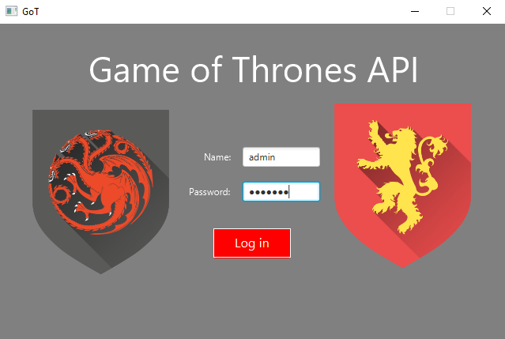

En caso de que alguno de los dos campos sea incorrecto aparecerá un mensaje indicando que el nombre o la contraseña son incorrectos.

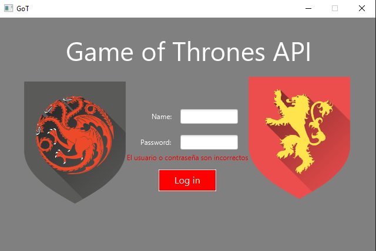

Una vez terminado el log in se accede a la pantalla de búsquedas donde se podrán realizar búsquedas de personaje por seis campos distintos: id, nombre, apellido, nombre completo, titulo y familia.
En caso de que haya varios personajes que coincidan con la búsqueda realizada estos apareceran en una tabla. Además se puede utilizar el botón "Limpiar" para vaciar los campos de búsqueda.

Para comprobar el funcionamiento se han realizado varias consultas distintas de selección, actualización y borrado.

En primer lugar tenemos una selección por un solo campo.

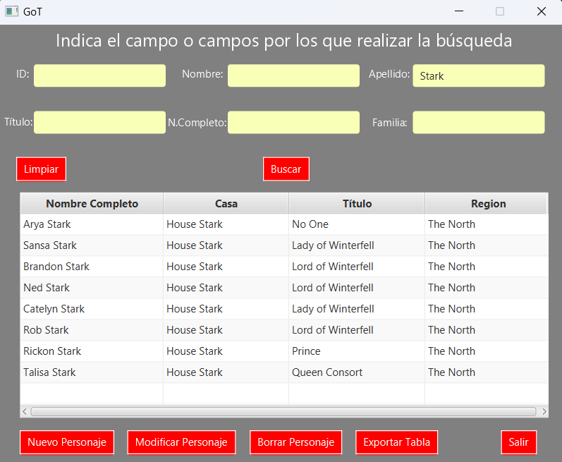

A continuación se ha realizado una búsqueda por varios campos.

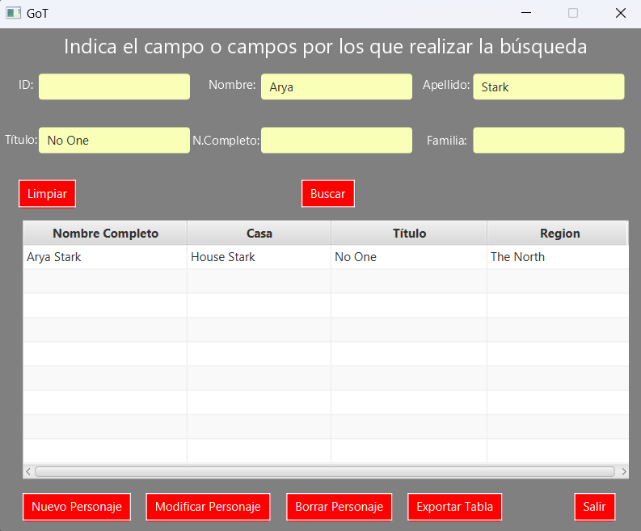

Despues se ha realizado la inserción de un nuevo personaje en la base de datos.

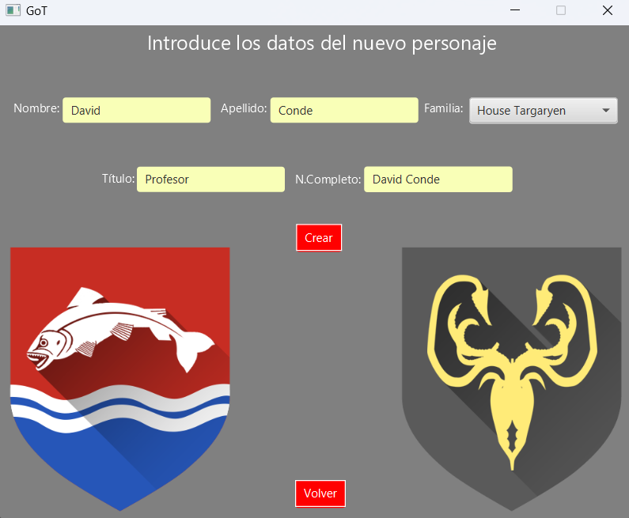

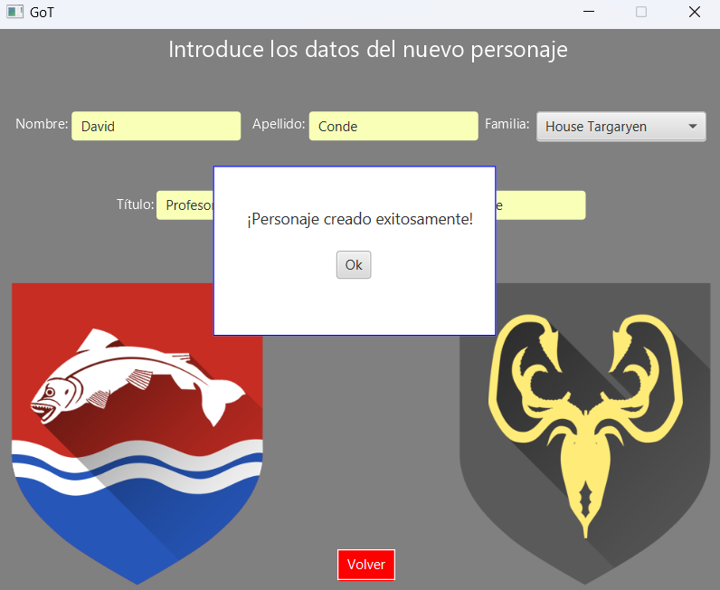

Se puede comprobar que el personaje se ha creado correctamente.

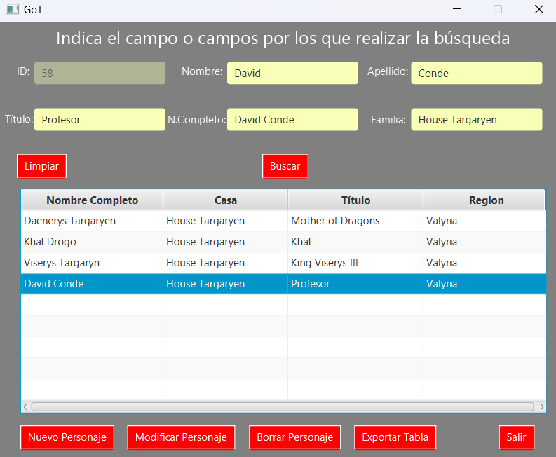

Para realizar las operaciones de modificación y borrado se debe seleccionar el personaje en la tabla.

En la siguiente consulta se modifica el personaje recién creado cambiando su "titulo".

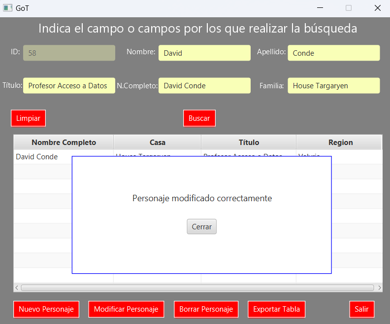

Se comprueba que el personaje se ha modificado correctamente.

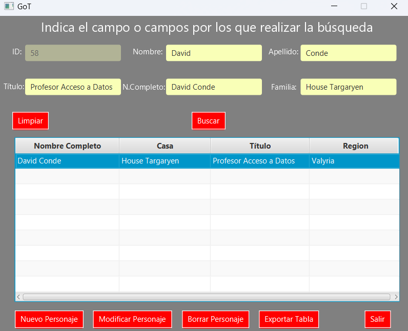

En esta última consulta se borra el personaje creado de la base de datos y se limpian los campos de búsqueda.

Además de las consultas y otras operaciones sobre la base de datos también se pueden exportar a json los datos de la búsqueda. Para ello se utiliza el botón "Exportar tabla", el cual lleva a una nueva página en la que se puede elegir el nombre del documento. Cuando la exportación se realice correctamente aparecerá una ventana emergente confirmando la exportación. Los documentos se guardarán en la carpeta *docs*.

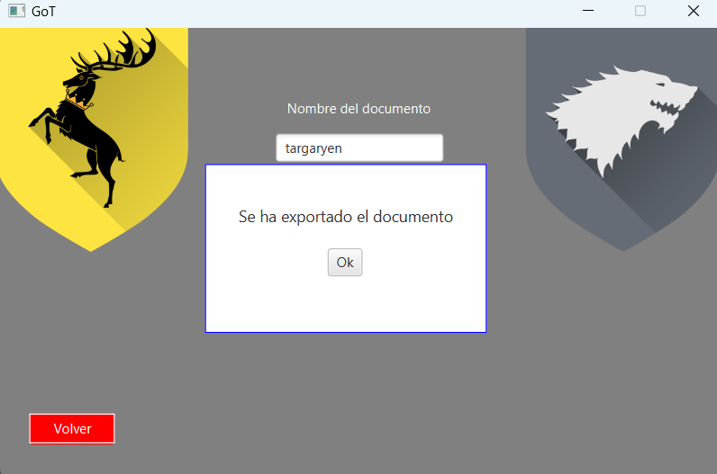.

En caso de que el nombre de documento esté vacío la exportación no se llevará a cabo.

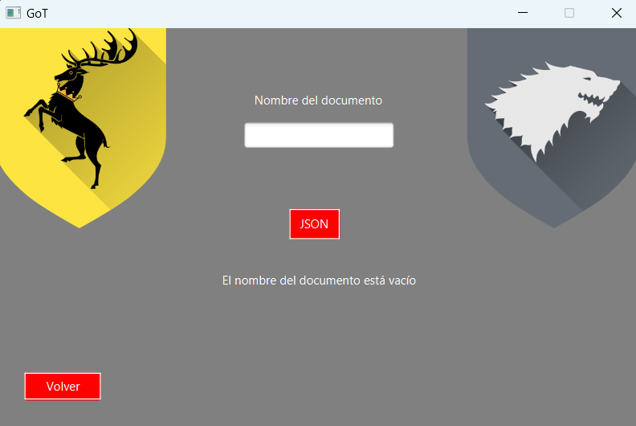.

Por último si se desea seguir realizando búsquedas se pulsará el botón *Volver* para ir a la pantalla de búsquedas.

# Reparto de tareas

Se han repartido las tareas en función del tiempo que se le ha dedicado a cada una de forma que este fuera equitativo:

Jorge ha implementado las funcionalidades de búsqueda por los distintos campos y mostrar los resultados mediante una tabla,  la verificación de usuarios y el login, el método para insertar personajes en la base de datos así como la interfaz de inserción de personaje y la creación de la base de datos para los usuarios.

Miguel ha implementado las funcionalidades de exportación a json, la interacción con la tabla para seleccionar un personaje, los métodos de modificación y borrado de personajes y la creación de la base de datos para los personajes, familias y fortalezas.

# Extras realizados

De los extras propuestos hemos implementado los siguientes: 

**Login**

Hemos diseñado una pantalla de Login en la que introduciremos usuario y contraseña almacenados en la base de datos **uduarios_db**

**Login ocultando pass**

En caso de no introducir bien algún parámetro nos mostrará un mensaje de error por pantalla. 

**Login error**

El código usado para implementar esta función ha sido el siguiente. 

**Método Login**

**Método de Verificación**

**Uso Offline**

Como ya inficamos también en el *Manual técnico para desarrolladores*, nuestra aplicación realiza las consultas contra un archivo JSON dentro de la propia aplicación , por lo que no requiere de conexión a internet para realizar 
las consultas. (Leer creación del método "Initialize")
# Propuestas de mejora

Entre las mejoras que se podrían implementar estan:

- Añadir un mensaje que indique que no se han encontrado coincidencias al realizar la búsqueda.
- Actualmente los datos se extraen de un json obtenido de la API y que se ha guardado en la carpeta *resources*, la mejora sería implementar que la búsqueda se realizara directamente contra la API.
- Encriptar los datos del fichero properties para el log in.

# Conclusiones

En un principio el proyecto fue avanzando lentamente debido a la falta de conocimiento de JavaFX de los integrantes del grupo, sin embargo al entender como funciona se comezó a trabajar de manera más agil permitiendo alcanzar los requerimientos del proyecto dentro del plazo de entrega.

# Dedicación temporal

A este proyecto cada uno de los integrantes le ha dedicado un total de 20 horas divididos entre los distintos días de la semana de la siguiente manera.

